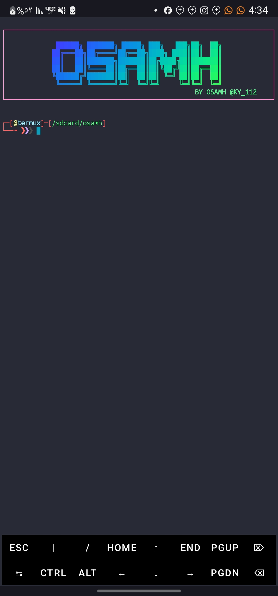
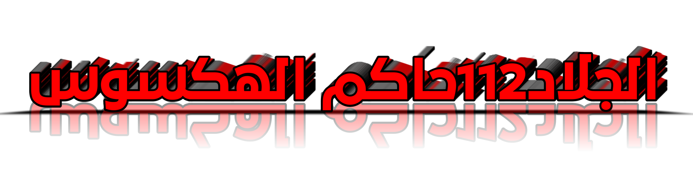

# PROGRAMMER OSAMH FADEL
تم تطوير هاذه الاداه بواسطه / المبرمج /اسامة فاضل
المعروف باسم /الجلاد112حاكم الهكسوس شخصيا
## Preview of after setup completed..

معلومات المبرمج / اسامة فاضل 
- [x]  @V00_8 قناتي ع تلجرام 
- [x]  @KY_112 معرف حسابي ع تلجرام
- [x]  @lky_112l معرف حسابي ع انستقرام 
- [x]  +967774595600 

- [x] ستأتي ايام تدرسون فيها اسمي كمناهج اساسيه للتربيه والتعنيف
- [ ]  الجلاد112حاكم الهكسوس شخصيا# 

## Termux keyboard features with shortcuts

- [x] open new session `CTRL + t`
- [x] close terminal  swipe up throughout that icon
- [x] swich between two sessions `CTRL + 4` and `CTRL + 5`
- [x] other shortcuts need video guide.

## Download and installation steps

1. `apt update && yes | apt upgrade && apt update && apt install git -y`
2. `git clone 
https://github.com/HACKSOSS/THE_KING_OF_HACKSOSS`
3. `cd  THE_KING_OF_HACKSOSS/`
4. `ls`
5. `bash osamh.sh`
اضغط هنا للانضمام الئ قناتي ع يوتيوب { [قناتي ع يوتيوب](https://www.youtube.com/@l._?si=uhq8H7rcSgQY5pUV) }

 [قناتي ع تلجرام 
](https://t.me/V00_8)
## جميع الحقوق مطبوعه لدئ الجلاد حاكم الهكسوس#
